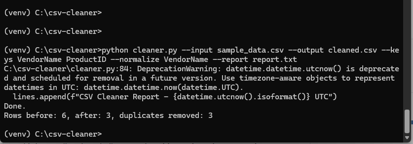

# CSV Cleaner (Python OOP-Project)

This is a small project I built to practice **Object-Oriented Programming (OOP) in Python** and apply it to a real-world task: cleaning CSV data.  

The tool removes duplicate rows from CSV files, outputs a clean version, and generates a simple text report.  
It directly connects to my professional experience in **data management and process improvement** at **Revvity Signals**, where handling large datasets and ensuring data quality were key responsibilities. This project specifically flagged duplicate vendor accounts—a critical task, as duplicates could create errors and disrupt the system integration of information flow among Salesforce.com, NetSuite, and Flexera, leading to delays in delivering customers’ final products, such as email access for software they had already purchased.

---

## 🚀 Features
- Class-based design using **OOP principles** (encapsulation & modularity)
- Reads CSV files and identifies duplicate rows
- Outputs a cleaned CSV file (`cleaned.csv`) with duplicates removed
- Generates a text report (`report.txt`) documenting the cleaning process

---

## 🛠️ Technologies
- **Python 3**
- Object-Oriented Programming (OOP)
- File handling: CSV and TXT
- Git & GitHub for version control

---

## 📖 Usage
1. Clone the repository:
   ```bash
   git clone https://github.com/gonznavs/csv-cleaner.git

2. Navigate into the project folder:
   ```bash
   cd csv-cleaner
   
3. Run the script:
   ```bash
   python cleaner.py

## 📂 Example
- Input: sample_data.csv with duplicate vendor records.
- Output:
     - (`cleaned.csv`) → cleaned file with duplicated removed
     - (`report.txt`)  → summary of records processed & duplicates found

## 📂 Example Run
Below is an example run of the script on sample data for testing:




## 🎯 Skills
- Python (Object-Oriented Programing)
- Data cleaning and validation
- Git & GitHub project setup
- Practical application of IT and data management experience

## 👤 Author
**Emmanuel Gonzalez**
  - LinkedIn: linkedin.com/in/gonznav
  -   Email: gonznav@outlook.com

## 🔭 Motivation
This project was created as part of my transition into Computer Science and Cybersecurity, to demonstrate hands-on programing skills in Python. It directly supports applications such as SAP's "Bildung und Training" program by showcasing my ability to connect real-world business data experience with technical programming foundations.
